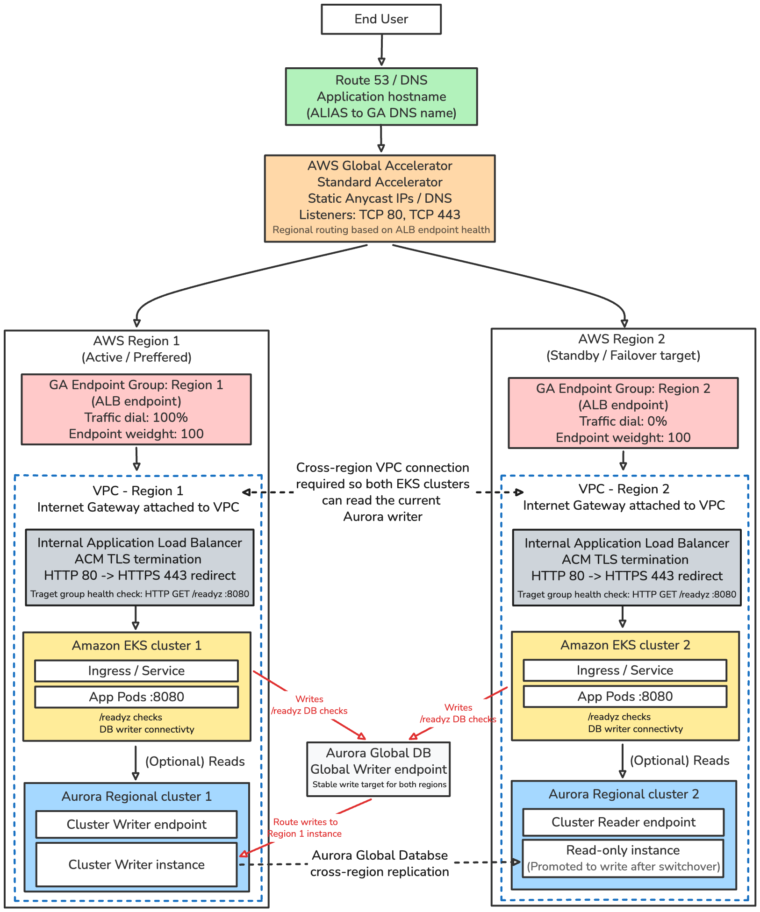

# AWS Multi-Region EKS

This repository is a Terraform example and reference for deploying an application across multiple AWS regions with regional EKS clusters, Aurora Global Database, and AWS Global Accelerator. It illustrates patterns for regional availability, geographic distribution that keeps users closer to workloads, compliance or regulatory requirements, and disaster recovery.

## Architecture



## Notes

The diagram shows the intended runtime flow:

- AWS Global Accelerator is the public entry point and routes traffic to regional internal ALB endpoints.
- HTTP-to-HTTPS redirects happen on the ALBs.
- ALB target groups and Kubernetes readiness probes use the database-aware `/readyz` endpoint.
- `/readyz` connects to the Aurora Global Database writer endpoint and verifies that the session is writable.
- Cross-region VPC peering, routes, and database security groups let either EKS region reach the current writer.
- Global Accelerator resources use a dedicated `us-west-2` AWS provider; the endpoint groups remain regional.

## 1. Prerequisites

- Terraform 1.15.8, AWS CLI, kubectl, and Helm
- AWS credentials or an AWS profile with permissions for the resources in this repository
- A public Route53 hosted zone and application hostname, such as `app.example.com`

The two regions must belong to the same AWS account. Aurora Global Database and Global Accelerator incur charges; destroy the lab when finished.

## 2. Bootstrap the Terraform backend

Choose a globally unique bucket name:

```sh
./scripts/bootstrap-backend.sh YOUR_UNIQUE_BUCKET eu-central-1
```

The script enables S3 versioning, AES-256 server-side encryption, public-access blocking, and writes the ignored `terraform/bootstrap/backend.hcl`. Both roots use native S3 lockfiles; no DynamoDB table is created.

## 3. Configure variables

```sh
cp terraform/infrastructure/terraform.tfvars.example terraform/infrastructure/terraform.tfvars
cp terraform/edge/terraform.tfvars.example terraform/edge/terraform.tfvars
```

Set the same `project_name`, regions, `domain_name`, and `route53_zone_id` in both files.

## 4. Deploy infrastructure

For an existing deployment with internet-facing ALBs, destroy the edge root before this apply and redeploy it in step 7 after the replacement internal ALBs are active.

```sh
cd terraform/infrastructure
terraform init -backend-config=../bootstrap/backend.hcl
terraform plan
terraform apply
```

## 5. Configure kubectl

```sh
aws eks update-kubeconfig --region eu-central-1 --name multi-region-lab-primary --alias primary
aws eks update-kubeconfig --region eu-west-1 --name multi-region-lab-secondary --alias secondary
kubectl --context primary get nodes
kubectl --context secondary get nodes
```

## 6. Verify both ALBs

Wait until each Ingress has an address and each internal ALB reports `active`:

```sh
kubectl --context primary get ingress regional-test
kubectl --context secondary get ingress regional-test
kubectl --context primary get ingress regional-test -o go-template='{{index .metadata.annotations "alb.ingress.kubernetes.io/healthcheck-path"}}{{"\n"}}'
kubectl --context secondary get ingress regional-test -o go-template='{{index .metadata.annotations "alb.ingress.kubernetes.io/healthcheck-path"}}{{"\n"}}'
aws elbv2 describe-load-balancers --region eu-central-1 --names multi-region-lab-primary --query 'LoadBalancers[0].[Scheme,State.Code,DNSName]'
aws elbv2 describe-load-balancers --region eu-west-1 --names multi-region-lab-secondary --query 'LoadBalancers[0].[Scheme,State.Code,DNSName]'
terraform apply -refresh-only
terraform output primary_alb_dns_name
terraform output secondary_alb_dns_name
```

## 7. Deploy the edge

```sh
cd ../edge
terraform init -backend-config=../bootstrap/backend.hcl
terraform plan
terraform apply
```

## 8. Verify

```sh
terraform output global_accelerator_dns_name
terraform output global_accelerator_static_ips
curl -i https://app.example.com/
curl -i https://app.example.com/healthz
curl -i https://app.example.com/readyz
```

The `/` response is `region=eu-central-1` or `region=eu-west-1` with the default regions. `/healthz` checks the application process; `/readyz` succeeds only when the current Aurora writer is reachable and writable. Verify the database endpoints from the infrastructure root:

```sh
cd ../infrastructure
terraform output aurora_global_writer_endpoint
terraform output aurora_secondary_reader_endpoint
aws secretsmanager describe-secret --region eu-central-1 --secret-id multi-region-lab/aurora-master --query ARN --output text
```

Check TCP connectivity from the primary app network to the global writer, and from the secondary app network to both its local reader and the global writer:

```sh
GLOBAL_WRITER=$(terraform output -raw aurora_global_writer_endpoint)
SECONDARY_READER=$(terraform output -raw aurora_secondary_reader_endpoint)
kubectl --context primary run db-check --rm -i --restart=Never --image=postgres:16-alpine -- pg_isready -h "$GLOBAL_WRITER" -p 5432
kubectl --context secondary run db-check-reader --rm -i --restart=Never --image=postgres:16-alpine -- pg_isready -h "$SECONDARY_READER" -p 5432
kubectl --context secondary run db-check-writer --rm -i --restart=Never --image=postgres:16-alpine -- pg_isready -h "$GLOBAL_WRITER" -p 5432
```

Pod readiness probes and ALB target-group health checks call `/readyz`. The endpoint opens a TLS connection to the global writer and verifies that `transaction_read_only` is `off`. Credentials are stored in Secrets Manager and copied into Kubernetes Secrets; Aurora write forwarding is not enabled.

## 9. Test traffic steering and failover

To test manual traffic steering, change `100/0` to `0/100` in `terraform/edge/terraform.tfvars`:

```hcl
primary_traffic_dial   = 0
secondary_traffic_dial = 100
```

Run `terraform plan` and `terraform apply`, then repeat the HTTPS request. `50/50` is also supported. Traffic dials affect new connections; they do not perform health checks.

To test automatic health-based failover, apply `100/0`, then remove the primary ALB's healthy targets:

```sh
kubectl --context primary scale deployment regional-test --replicas=0
until curl -fsS https://app.example.com/ | grep -q eu-west-1; do sleep 5; done
kubectl --context primary scale deployment regional-test --replicas=2
```

After health checks converge, the response comes from the secondary region. Global Accelerator can use a healthy endpoint group whose normal traffic dial is `0` during failover.

Aurora switchover is a separate operation. For a planned switchover to the secondary region:

```sh
SECONDARY_CLUSTER_ARN=$(aws rds describe-db-clusters --region eu-west-1 --db-cluster-identifier multi-region-lab-secondary --query 'DBClusters[0].DBClusterArn' --output text)
aws rds switchover-global-cluster --region eu-west-1 --global-cluster-identifier multi-region-lab --target-db-cluster-identifier "$SECONDARY_CLUSTER_ARN"
kubectl --context secondary get pods -l app=regional-test
curl -i https://app.example.com/readyz
```

The global writer hostname remains unchanged and follows the promoted writer. Review the Terraform plan before any later apply or destroy after changing database roles.

## 10. Destroy

Destroy edge first, then infrastructure:

```sh
cd terraform/edge
terraform destroy
cd ../infrastructure
terraform destroy
```
